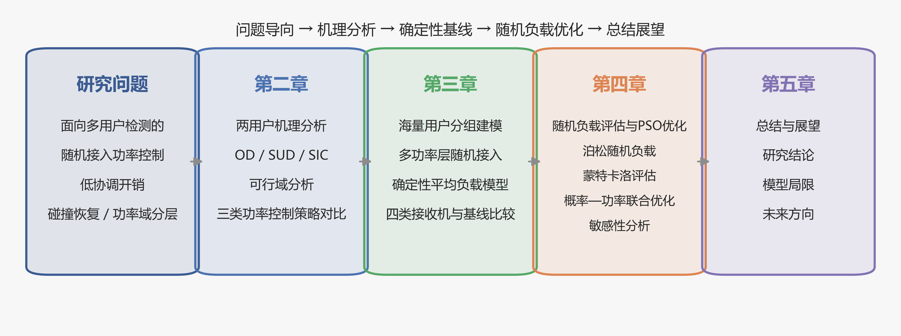
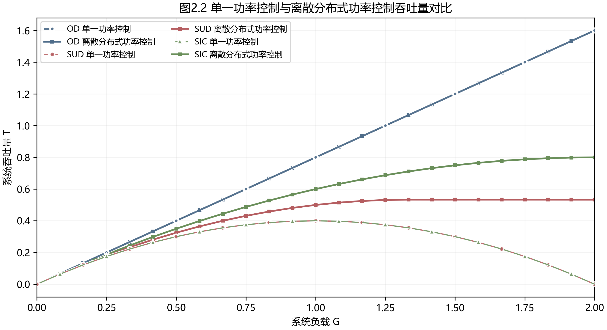
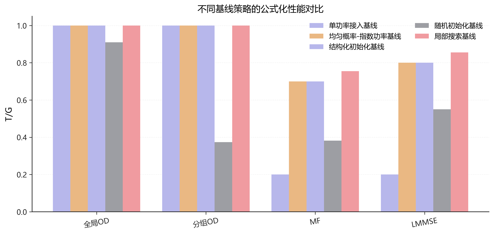
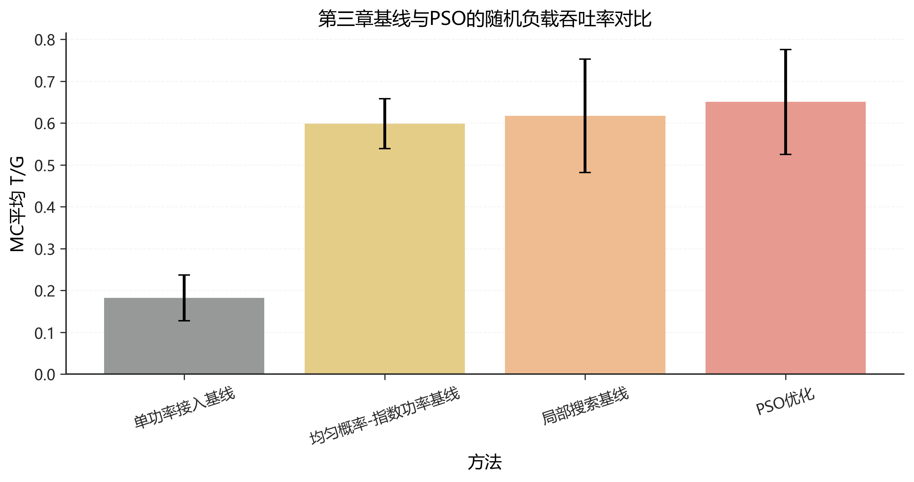
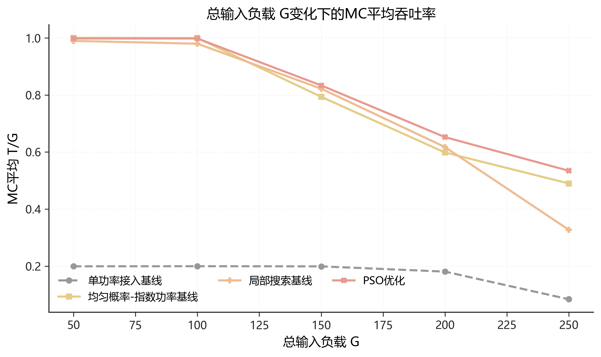

# Distributed Power Control for Multiuser Detection

面向多用户检测的分布式功率控制个人研究项目，包含可复现实验代码与精选结果。作者为尹灵峙，2026 年。

This personal research project contains reproducible code and selected results for distributed power control in random-access systems with multiuser detection, developed by 尹灵峙 in 2026.



## 中文说明

研究从两用户可行功率域出发，逐步扩展到分组功率接入、不同多用户检测接收机的性能比较，以及基于蒙特卡洛评估的粒子群优化。公开包只包含作者拥有发布权的代码、自生成数据和精选研究图，不包含工作文档、演示材料、行政文件或第三方文献。

主要内容：

- Part I：OD、SUD、SIC 接收机下的离散分布式功率控制分析。
- Part II：分组负载模型、结构化初始化和局部搜索基线。
- Part III：泊松随机负载下的蒙特卡洛复评估、PSO 优化和敏感性分析。

代表性结果：

| Part I 吞吐量 | Part II 基线 | Part III 基线与 PSO | 敏感性分析 |
| --- | --- | --- | --- |
|  |  |  |  |

完整图表和数据映射见 [RESULTS_INDEX.md](RESULTS_INDEX.md)。

## English summary

The project progresses from the feasible power regions of a two-user model to grouped power access, receiver-aware baselines, and Monte Carlo-based particle swarm optimization. The release contains only author-owned source code, generated data, and a curated research-figure set.

The main components are:

- Part I: discrete distributed power control under OD, SUD, and SIC receivers.
- Part II: grouped-load modeling, structured initialization, and local-search baselines.
- Part III: Poisson random-load re-evaluation, PSO optimization, and sensitivity analysis.

## Installation

Python 3.12 is the reference runtime.

```bash
python -m venv .venv
python -m pip install --upgrade pip
python -m pip install -e .
```

## Reproduction

Run the reduced smoke workflow:

```bash
python -m dpc_mud reproduce --quick --output-dir results/generated
```

Run the full workflow by omitting `--quick`:

```bash
python -m dpc_mud reproduce --output-dir results/generated
```

Generated results are intentionally ignored by Git. The reviewed snapshot is stored under `results/published`. See [REPRODUCING.md](REPRODUCING.md) for experiment order and output conventions.

## Repository map

- `src/dpc_mud/parts/part1_two_user`: analytical two-user experiments.
- `src/dpc_mud/parts/part2_grouped_access`: grouped-load model and local search.
- `src/dpc_mud/parts/part3_stochastic_optimization`: Monte Carlo evaluator and PSO.
- `src/dpc_mud/workflows`: Part II/III experiment and plotting entry points.
- `workflows`: concise descriptions of the reproducibility workflows.
- `configs`: published experiment configurations.
- `results/published`: reviewed figures and compact data.
- `tests`: consistency and release checks.
- `tools`: snapshot curation and privacy-audit utilities.

## Citation and license

Citation metadata is provided in [CITATION.cff](CITATION.cff). Code and author-generated results are released under the [MIT License](LICENSE).
